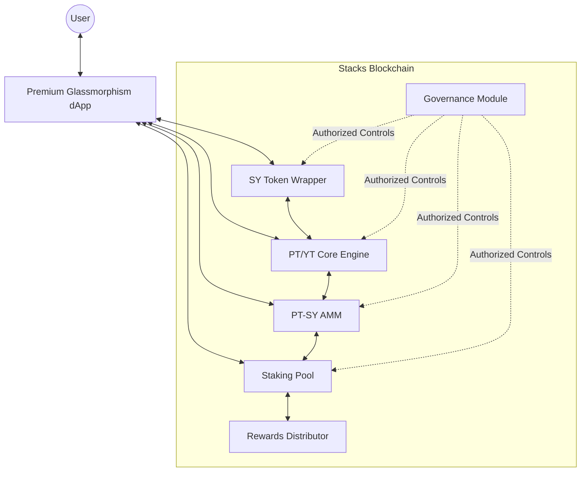

# Stakied Protocol Architecture

## System Design Overview

Stakied is a yield tokenization protocol that allows users to split yield-bearing assets into separate principal and yield components. This design document outlines the architecture, data models, and security considerations of the hardened protocol.

## High-Level Architecture



## Core Contract Ecosystem

### 1. SY Token Contract (Standardized Yield)
**Purpose**: Wraps various yield-bearing assets into a unified SIP-010 interface.
- **Dynamic Exchange Rate**: Reflects yield accrual of underlying assets.
- **Operational Controls**: Integrated `pause` and `transfer-ownership`.
- **Standardized Events**: Rich telemetry for indexers.

### 2. PT/YT Core engine
**Purpose**: Manages the lifecycle of Principal Tokens (PT) and Yield Tokens (YT).
- **Minting**: Splits SY into PT (principal) and YT (yield).
- **Maturity Enforcement**: PTs are locked until a specific block height.
- **Yield Distribution**: YT holders claim real-time yield from the underlying SY.
- **Recombination**: Burn PT + YT to reclaim SY at any time.

### 3. PT/YT AMM (Liquid Yield Market)
**Purpose**: Automated Market Maker for trading PT against SY.
- **Time-Decay Pricing**: Custom bonding curve for expiring assets.
- **Fee Management**: Standard 0.3% trading fee distributed to LPs.
- **Slippage Protection**: Native check for minimum received amounts.

### 4. Staking Pool & Rewards
**Purpose**: Incentivizes protocol liquidity and participation.
- **LP Staking**: Stake AMM LP tokens to earn protocol rewards.
- **Weighted Rewards**: Dynamic distribution via the `stakied-rewards-distributor`.
- **Emission Control**: Authorized updates to reward rates and global configurations.

## Hardened Security & Governance

### Ownership Abstraction
All contracts move away from static principals to dynamic ownership:
```clarity
(define-data-var contract-owner principal tx-sender)

(define-public (transfer-ownership (new-owner principal))
    (begin
        (asserts! (is-eq tx-sender (var-get contract-owner)) (err ERR-OWNER-ONLY))
        (ok (var-set contract-owner new-owner))))
```

### Protocol Circuit Breakers
Operational safety is guaranteed via the emergency pause pattern:
- **Global `is-paused` flag**: Stops all state-changing operations during anomalies.
- **Granular Control**: Each module can be paused independently to isolate issues.

### Unified Error Schema
The protocol uses a standardized numeric error range to facilitate robust integration:
- `u1 - u99`: Universal Security & Access Errors
- `u100 - u199`: SY Token Logic
- `u200 - u299`: PT/YT Lifecycle
- `u300 - u399`: AMM Mathematics
- `u400 - u499`: Staking & Distributions

## Core Data Flows

### The Tokenization Journey
1. **Wrap**: User deposits stSTX into `sy-token` → receives SY.
2. **Split**: User calls `mint-pt-yt` on `pt-yt-core` → SY is locked, PT and YT are minted.
3. **Maturity**:
    - **Before**: User can sell PT on AMM or collect yield via YT.
    - **After**: User redeems PT 1:1 for SY. YT becomes a historical record.

## Technical Specifications

| Component | Standard | Features |
|-----------|----------|----------|
| SY Token | SIP-010 | Indexed Events, Pausable, Owned |
| PT/YT | SIP-010 | Multi-maturity maps, Yield tracking |
| AMM | Custom | Constant Product + Time Decay |
| Staking | Custom | Per-user accrual, Reward scaling |

---

**Document Version**: 2.0 (Hardened)  
**Last Updated**: February 27, 2026
